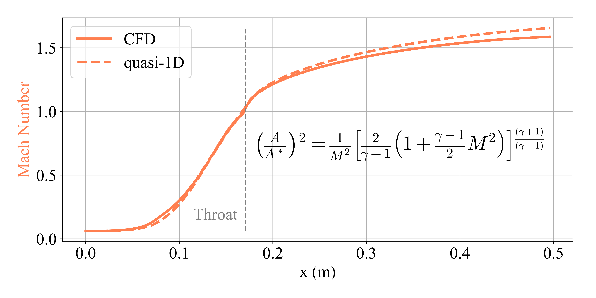
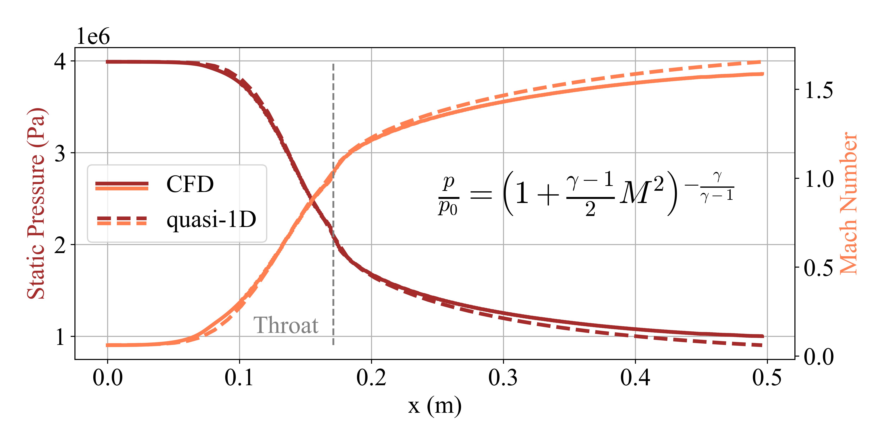
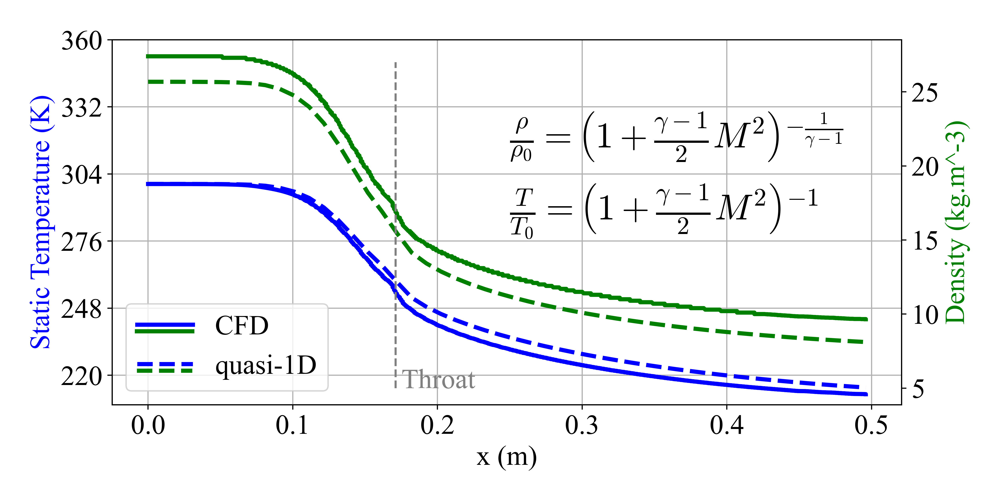

# Convergent-Divergent Nozzle Flow Analysis and Comparison

This repository contains Python code for calculating and comparing the results of flow through a convergent-divergent nozzle. The calculations are based on quasi-one-dimensional, isentropic, and perfect gas flow equations sourced from the literature. Additionally, the repository includes Computational Fluid Dynamics (CFD) simulation results obtained using Ansys Fluent. This code is part of a more complete study on flow through a supersonic gas separator.

## Background

### Nozzle Flow
Within the first section of a convergent-divergent nozzle, the high-pressure flow converges down to the minimum area, or throat, of the nozzle. The throat size is chosen to choke the flow and set the mass flow rate through the system. The flow in the throat is sonic which means the Mach number is equal to one in the throat. Downstream of the throat, the geometry diverges and the flow is expanded to a supersonic Mach number that depends on the area ratio of the exit to the throat. The expansion of a supersonic flow causes the static pressure and temperature to decrease from the throat to the exit, so the amount of the expansion also determines the exit pressure and temperature. The exit temperature determines the exit speed of sound, which determines the exit velocity. The exit velocity, pressure, and mass flow through the nozzle determines the amount of thrust produced by the nozzle.

### Supersonic Separator

The supersonic gas separator is a new technology that uses the processes of supersonic expansion and cyclonic separation to remove water and condensates, such as CO2, from natural gas. The supersonic device is formed by a convergent-divergent section where the flow is accelerated to supersonic speed in the nozzle, followed by a cyclonic separation region connected to a diffuser. The process of separation occurs by supersonic expansion, which decreases the gas temperature such that some components (particularly CO2) are condensed; in turn, the liquid droplets formed are separated from the gas being conducted by centrifugation towards downstream collectors installed on the nozzle walls.

## Results

For both calculations, the fluid was considered methane and, for the CFD simulations, the SST k-omega turbulence model was applied, as well as the Redlich-Kwong real gas equation of state.

### Mach number 

### Static pressre and Mach number

### Static temperature

